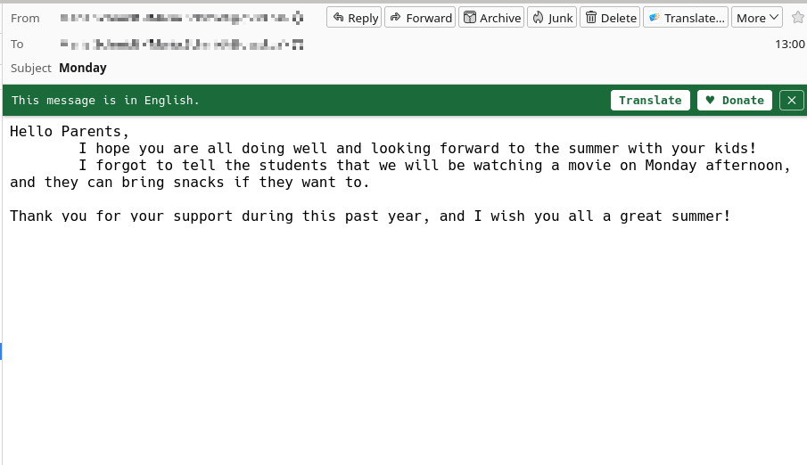
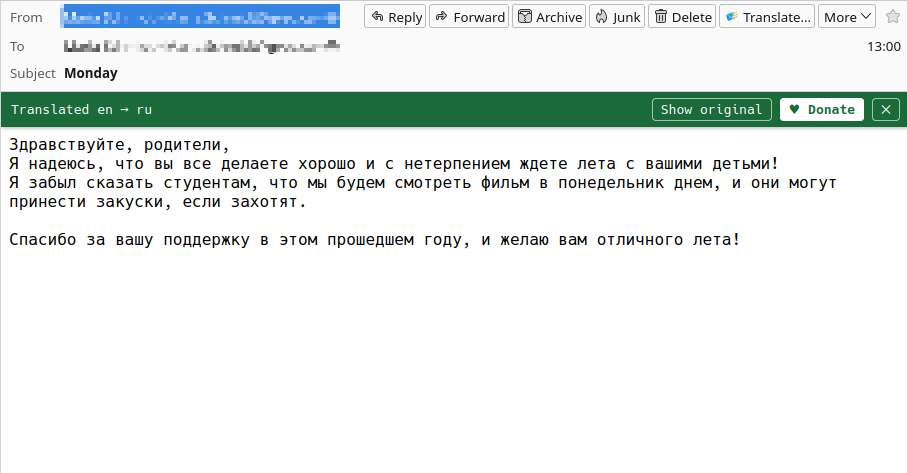
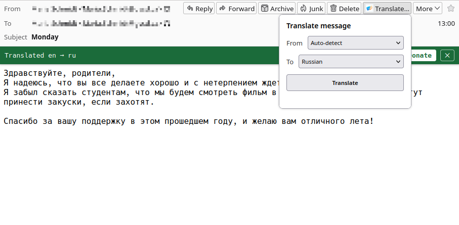
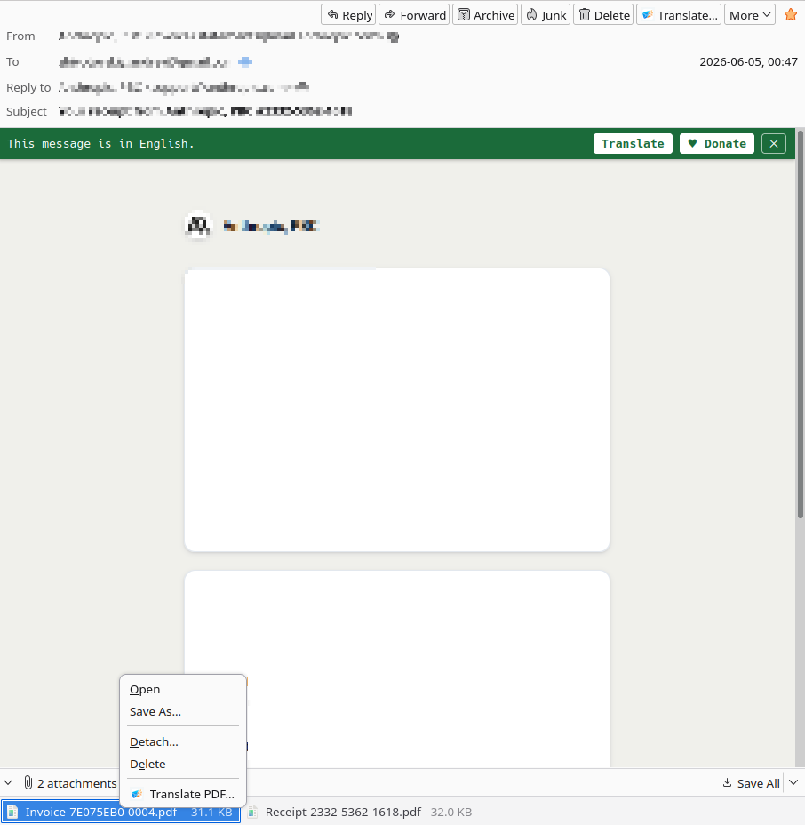
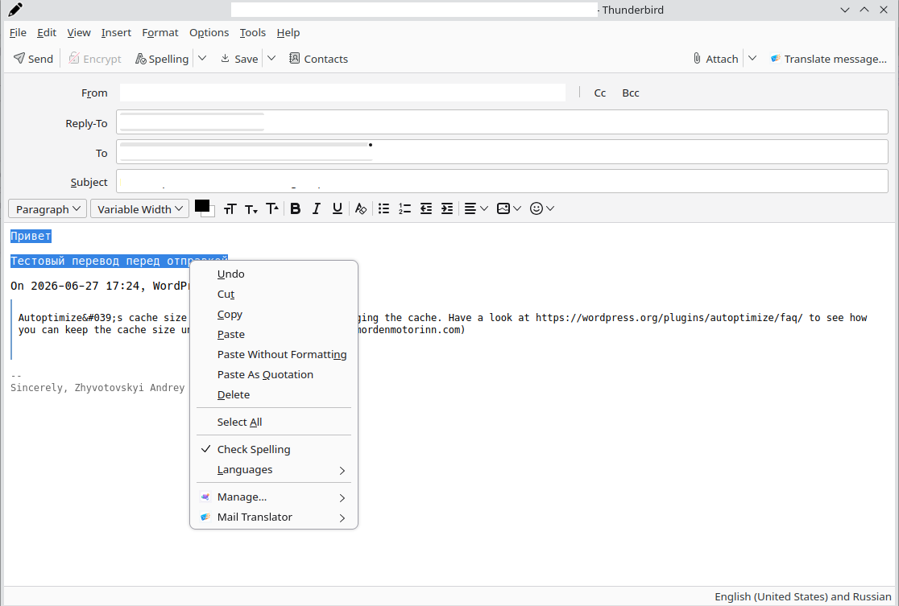

<div align="center">


<h1>Email Translator — Translate Offline &amp; Private</h1>

<p><strong>Приватный перевод писем на устройстве для Thunderbird.</strong></p>

<p>
  <a href="LICENSE"></a>
  <a href="https://www.thunderbird.net/"></a>
  <a href="https://github.com/LLC-BigInt/thunderbird-email-translator/releases/latest"></a>
  <a href="https://www.payments.bigint.pro/donate"></a>
</p>

<p><a href="README.md">English</a> · <b>Русский</b></p>

</div>

Дополнение для [Thunderbird](https://www.thunderbird.net/), которое переводит письма
**прямо на твоём устройстве**. Текст письма никогда не покидает компьютер — нет облака,
нет аккаунта, нет слежки. Открываешь письмо, выбираешь язык — и тело переводится
**на месте, с сохранением вёрстки** (так же, как Firefox переводит веб-страницу).

Работает на **[Bergamot](https://github.com/browsermt/bergamot-translator)** — это
WASM-движок нейронного перевода, тот же, что стоит за Firefox Translations.

## Скриншоты

<p align="center">
  <a href="assets/screenshot-1.png"></a>
  <a href="assets/screenshot-2.png"></a>
  <a href="assets/screenshot-3.png"></a>
  <a href="assets/screenshot-4.png"></a>
  <a href="assets/screenshot-5.png"></a>
</p>

<sub><i>Нажми на любую картинку, чтобы увеличить.</i></sub>

---

## Возможности

- **Приватно и оффлайн.** Перевод выполняется локально. Только языковая модель
  скачивается один раз (при первом использовании пары языков), дальше всё оффлайн.
- **Перевод тела письма** на месте, с переключателем **«Показать оригинал»**.
- **Перевод при написании** — выдели текст в редакторе письма и переведи его на месте.
- **Перевод PDF-вложений** — рендерит каждую страницу и накладывает переведённый текст
  поверх исходной вёрстки.
- **Авто-определение чужого языка** — предлагает (или сам запускает) перевод входящих
  писем на языке, который ты не читаешь.
- **Пропускает цитаты и подписи** — ответы остаются чистыми.
- **Много языков**, с автоматическим **пивотом через английский** для пар без прямой
  модели (например, `ru→de` = `ru→en→de`).
- **Менеджер моделей** в настройках — смотри закэшированные модели, их размер и удаляй
  в любой момент.

---

## Установка

### Из каталога Thunderbird Add-ons (рекомендуется)
Найди **«Email Translator»** в Thunderbird → *Дополнения и темы*, либо поставь с
[addons.thunderbird.net](https://addons.thunderbird.net/). Обновления приходят сами.

### Из релизного `.xpi`
1. Скачай последний `email-translator-<версия>.xpi` со страницы
   [**Releases**](https://github.com/LLC-BigInt/thunderbird-email-translator/releases/latest).
2. В Thunderbird: **Настройки ▸ Основные ▸ Редактор конфигурации** → поставь
   `xpinstall.signatures.required` в `false` (релизные сборки здесь без подписи;
   подписанные копии — из каталога).
3. **Дополнения и темы ▸ ⚙ ▸ Установить дополнение из файла…** → выбери `.xpi`.

**Требуется Thunderbird 115 или новее.**

---

## Использование

1. Открой письмо → нажми **Translate…** в шапке (или правый клик по телу письма →
   **Translate…**).
2. Выбери язык и нажми **Translate**. При первом использовании пары языков скачивается
   модель (несколько секунд), дальше — мгновенно и оффлайн.
3. Переключай **«Показать оригинал / перевод»** в панели или закрывай через **✕**.

Другие точки входа: правый клик по выделению в редакторе письма → **Translate selection
to ▸ <язык>**; правый клик по PDF-вложению → **Translate PDF…**. Язык по умолчанию и
закэшированные модели настраиваются на **странице опций** дополнения.

---

## Сборка из исходников

Зависимости рантайма **вшиты** в пакет; `node_modules` нужен только для разработки.

```bash
npm install         # dev-инструменты (esbuild, web-ext, тест-зависимости)
npm test            # юнит-тесты (node --test)
npm run bundle      # пересобрать бандлы после правок в lang/ content/ compose/
npm run lint:ext    # линтер web-ext
npm run build:ext   # сборка → web-ext-artifacts/email-translator-<версия>.xpi
./run_addon.sh      # запуск в Thunderbird через web-ext для разработки
```

Для разработки можно загрузить и без сборки: Thunderbird → **Инструменты ▸ Инструменты
разработчика ▸ Debug Add-ons** → **Load Temporary Add-on…** → выбрать `manifest.json`.

### Структура проекта
```
manifest.json   манифест MV2 (min TB 115)
background.js   меню, маршрутизация попапа, детекция + оркестрация перевода
popup/          попап выбора языка
content/        извлечение блоков тела письма + перевод на месте и переключатель
compose/        перевод выделения в редакторе письма
pdf/            просмотрщик PDF-вложений с наложением перевода
engine/         обёртка WASM-движка Bergamot + кэш моделей в IndexedDB
lang/           список языков, маппинг ISO, оффлайн-детекция (franc)
models/         реестр моделей + хранилище в IndexedDB
options/        язык по умолчанию, менеджер моделей, донат
```

---

## Приватность

Текст твоего письма **никуда не отправляется**. Единственный сетевой запрос — разовое
скачивание модели перевода из публичного бакета Bergamot при первом использовании пары
языков; дальше модели кэшируются локально в IndexedDB и работают оффлайн. Никакой
аналитики, аккаунтов и слежки.

---

## Сторонний код

Вшитые библиотеки (раскрыты в [`THIRD_PARTY.md`](THIRD_PARTY.md)):

- **Bergamot** переводчик + WASM-worker — MPL-2.0
- **pdf.js** — Apache-2.0
- **franc** определение языка — MIT

## Лицензия

[MIT](LICENSE) © BigInt

## Поддержка и донаты

Дополнение бесплатное. Если оно тебе помогает — поддержать разработку можно тут:
**[payments.bigint.pro/donate](https://www.payments.bigint.pro/donate)**.
Issues и контрибьюции приветствуются на
[GitHub](https://github.com/LLC-BigInt/thunderbird-email-translator/issues).
